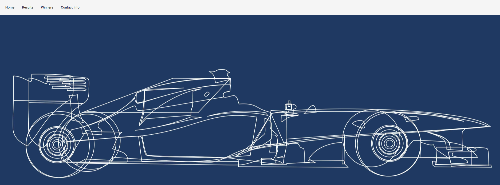
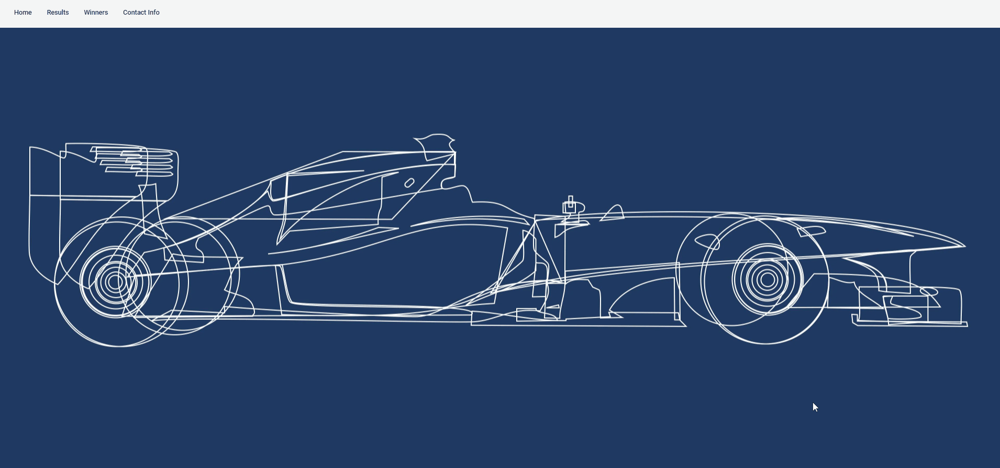
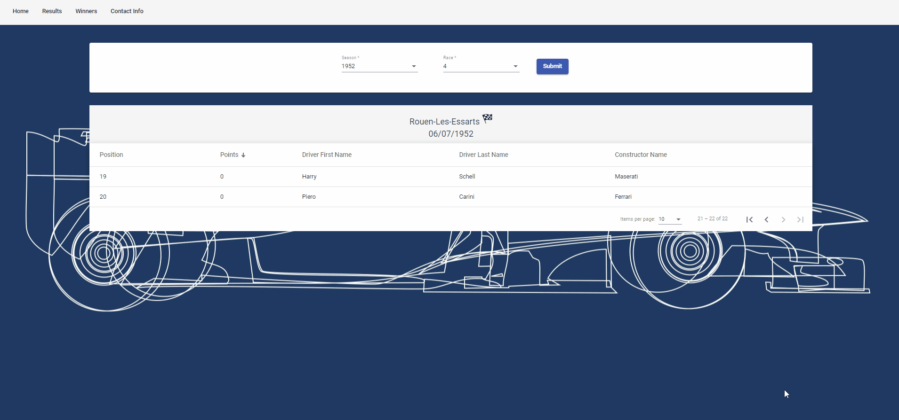
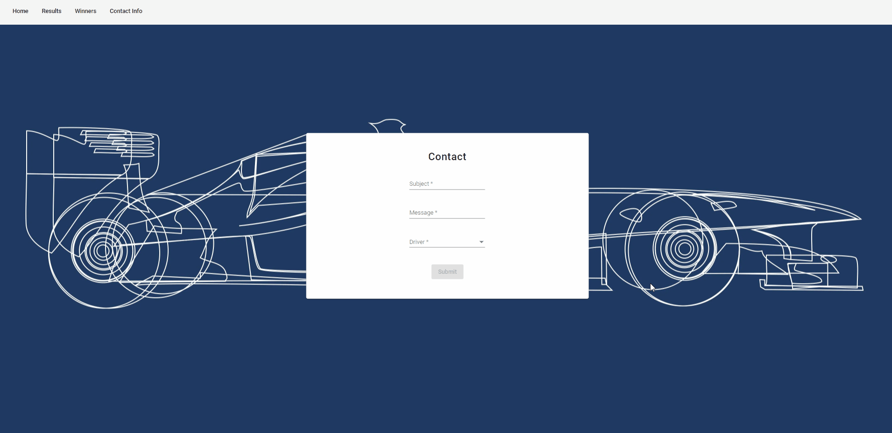

# Formula1App

This project was generated with:
  - [Angular CLI](https://github.com/angular/angular-cli) version 13.3.6.
  -  The latest version of Angular Material

## Development server

- Clone repository
- Run npm install
- Run ng serve for a dev server
- Navigate to http://localhost:4200/home. The app redirects to this url if user gonna navigate to an invalid path.

## Description

This project is a frontend application related to a given Formula 1 api. More specifically, the **basic features** for this app are the following:

### Mat-toolbar
- Mat-toolbar contains 4 tabs (Home, Results, Winners and Contact Info). Every tab routes to another url displaying on page different data.
 

### Results
- On results page, a dropdown list was generated which contains all available seasons of Formula 1 (GET: http://ergast.com/api/f1/seasons). After selecting an available season another dropdown list is shown. The second list contains all the available races related to the selected season (GET: https://ergast.com/api/f1/{selectedSeason}). The button is disabled and is gonna be enabled after selecting an available race. After clicking the button a MatTableDataSource is shown which contains all the data related to specific season and race (GET: https://ergast.com/api/f1/{selectedSeason}/{selectedRace}).
 

### Winners
- On winners page, the same dropdown list is also shown. After selecting an available season a MatTableDataSource is shown which contains all the data related to the winners (GET: https://ergast.com/api/f1/{selectedSeason}/driverStandings).

### Contact Info
- On contact info page, a reactive contact form was generated which contains subject, message and drivers name selector. Drivers were loaded to a dropdown list (GET: https://ergast.com/api/f1/drivers). Button which is responsible for sending the related message is also disabled if user doesn't complete all the mandatory fields. After clicking the button the application makes a post call to a fake url.
    

### MatSnackBar
- The application provides related messages if a call to the api is not successful. In order to show these messages to the user MatSnackBar was used.\
 

